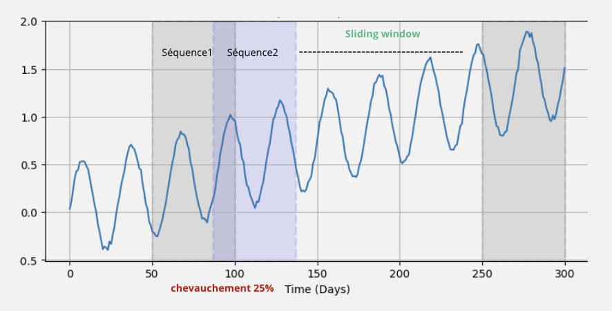
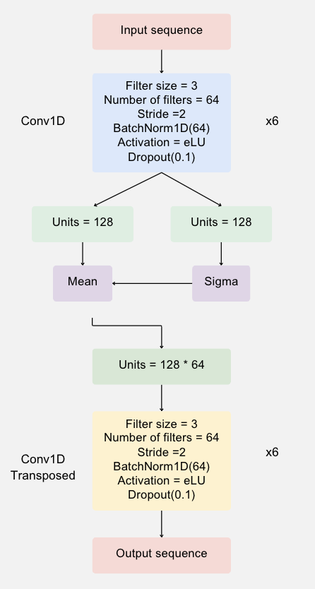

# 🔍 Détection d'Appareils Électriques Défectueux à partir de la Consommation Globale  

## 📝 Description  
Ce projet s'inscrit dans le cadre de la **détection d'anomalies dans la consommation énergétique** d'un foyer. L'objectif est d'identifier les **appareils électriques défectueux** en analysant la consommation totale, sans avoir accès directement à la consommation individuelle de chaque appareil.  

Pour ce faire, nous utilisons des techniques avancées de **Machine Learning non supervisé**, notamment :  
- **Autoencodeur Variationnel (VAE)** : Pour reconstruire les signaux et détecter les anomalies par écart de reconstruction.  
- **Temporal Convolutional Network Autoencoder (TCN AE)** : Pour capturer les motifs temporels et améliorer la détection des anomalies.  
- **CNN Classificateur** : Pour classifier les séquences comme normales ou anormales.  

L’ensemble de ces méthodes permet d’identifier les équipements présentant des comportements anormaux, comme une **surchauffe** ou un **dysfonctionnement prolongé**.  

---

## 🎯 Objectifs  
✅ Identifier les **appareils défectueux** à partir de la consommation totale.  
✅ Détecter les **anomalies** de fonctionnement en se basant sur des modèles non supervisés.  
✅ Simuler différents types de **défauts** pour valider les performances des modèles.  
✅ Automatiser le processus d’identification et **envoyer une notification** en cas d’anomalie.  

---

## 📊 Datasets Utilisés  
Nous avons travaillé avec **trois bases de données publiques** qui enregistrent la consommation énergétique des foyers :  

| Dataset  | Nombre de foyers | Durée d'enregistrement | Fréquence | Type de données |
|----------|----------------|--------------------|------------|---------------|
| **REFIT**  | 9 maisons   | 2 ans  | 1/8 Hz  | Agrégées & Désagrégées |
| **UK-DALE** | 5 maisons   | 2 ans  | 1/6 Hz  | Agrégées & Désagrégées |
| **REDD**    | 6 maisons   | 18 mois | 1/2 Hz  | Agrégées & Désagrégées |

📌 **REMARQUE** : Ces bases de données contiennent des mesures globales et individuelles de consommation. L’objectif du projet est de retrouver **quel appareil est défectueux uniquement à partir de la consommation totale**.

---

## 🛠️ Prétraitement des Données  
Avant d’entraîner nos modèles, nous avons réalisé plusieurs étapes de **prétraitement** :  

1. **Segmentation des signaux** 📏 :  
   - Application d’une **fenêtre glissante** pour diviser les séries temporelles en **séquences de 4032 points**.  
   - **Chevauchement de 25%** pour mieux capturer la dynamique temporelle.  

2. **Normalisation des données** 📊 :  
   - Mise à l’échelle des signaux entre **0 et 1** pour éviter les biais liés aux variations d’unités.  

3. **Séparation en ensembles** 🏷️ :  
   - **80% pour l’entraînement**, **20% pour le test**.  
   - Conservation de la **structure temporelle** (pas de mélange aléatoire).  

📸 *Exemple de segmentation des données* :   

  

---

## ⚡ Simulation des Anomalies  
Les anomalies réelles sont **rares** dans les données. Pour tester nos modèles, nous avons simulé **deux types d’anomalies** :  

### 1️⃣ **Anomalie de type Fréquence** 🔄  
➡️ Reproduction d’un cycle ON/OFF du réfrigérateur en **augmentant sa fréquence**.  

### 2️⃣ **Anomalie de type Durée Prolongée** ⏳  
➡️ Simulation d’une **surcharge prolongée** en augmentant artificiellement la consommation d’un appareil sur une longue période.  

---

## 🏗️ Modèles et Approches  
Nous avons comparé plusieurs approches pour détecter ces anomalies :  

### 1️⃣ **Autoencodeur Variationnel (VAE)**  
- Apprend à reconstruire un signal **normal**.  
- Une anomalie est détectée si l’erreur de reconstruction dépasse un **seuil**.  

📸 *Architecture du VAE* :  
 

  

 

---

### 2️⃣ **Temporal Convolutional Network Autoencoder (TCN AE)**
- Utilisation d'un **réseau de neurones convolutif temporel** pour mieux capturer les dépendances à long terme.  
- Architecture avec des **couches causales** et **dilatées** pour maximiser la prise en compte des tendances.  

📸 *Architecture du TCN AE* :  
  

  

 
---

### 3️⃣ **Méthode de Seuillage pour la Détection**  
Nous avons utilisé une approche basée sur l’erreur de reconstruction pour détecter les anomalies :  
- Calcul de **l’erreur de reconstruction** entre l’entrée et la sortie du modèle.  
- Définition d’un **seuil** basé sur la moyenne et l'écart type :  
  \[
  \lambda = \mu + 3 \times \sigma
  \]
- Une séquence est considérée comme anormale si son erreur de reconstruction dépasse **λ**.  

...

---
